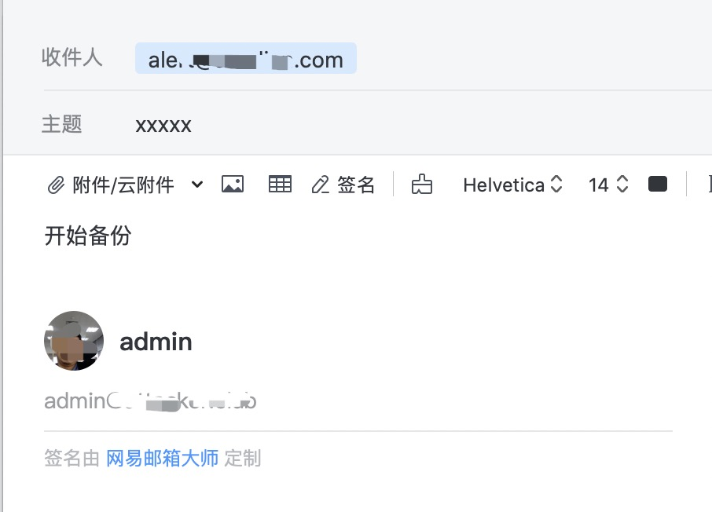
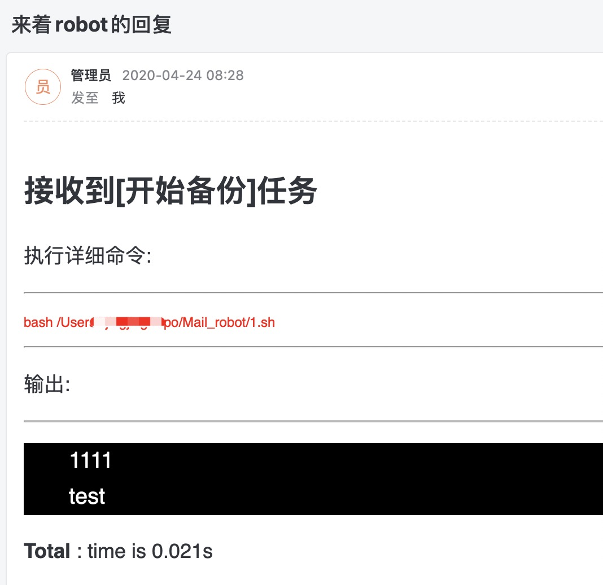

# Mail_robot

## 介绍

通过邮件接收指令；当发送`my.conf`定义的任务后，会将执行结果通过邮件反馈。

### 环境


```bash
pip install jinja2  beautifulsoup4
```


### 发送指令到监听邮箱

```mail
curl_bash
# 邮件的body内容格式 task：[my.conf定义的任务名]
```

## 执行任务

```bash
sudo python main.py
```

打印输出

```log
已连接服务器
成功登陆邮箱
待处理邮件: 0
没有邮件处理
登出邮件系统
没有发件人
dict_items([('task', 'Null'), ('code', '未接收到命令!!!')])
继续监听邮件...
```

### 例子

**发送指令:**


**返回处理结果:**

